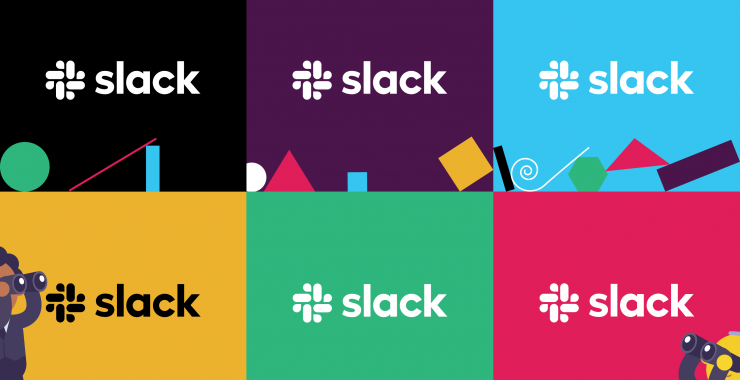

### Rationale
This repository represents a collection of utilities one can use to customize Slack UI in case if the app doesn't provide respective settings.
Since Slack team can change the app structure the way they want this tool might become outdated upon the next release.
A basic understanding of html, css and js is highly advised before using the tool.

### Things supported at the moment
[x] Custom styles injection (if you've been missing a dark theme in Slack, then just add some custom styles yourself)

### First things first
Install the npm packages by running the following command in your terminal (make sure you do that in the project folder):
```
npm i
```

### How to use the tool
First close Slack.
Next put the respective data into `user-input` file and launch a required `npm` script.
For example, if you need to inject some custom styles (e.g. change Slack default font family) put the following to the `user-input`:
```css
* {font-family: "ibm plex mono" !important}
```
Once the user data has been provided, run that from your terminal:
```
npm run styles-inject
```
Now open Slack and observe the changes made.

### What should I do in case if I spoiled the original `app.asar`?
Don't worry. You've been covered. Just type that in your terminal to restore a backup:
```
npm run restore-backup
```
Upon making any changes the tool will always create a backup first but keep in mind it'll make no assumptions whether you've modified it before or not (e.g. assembled manually by adding some patches before). 

### Ok, I've restored a backup but Slack still doesn't launch
That is possible in case if the original app archive was spoiled already prior to launching the tool.
That way just [reinstall Slack](https://slack.com/downloads).

### I just updated Slack and lost my patches
That is expected behavior because Slack can update the app archive upon major/minor/patch updates.
In that case, please, apply a previous patch by running the tool again.

### I have an idea for a thing X to be implemented. To whom should I reach out?
Just shoot an email to jason.rammoray@gmail.com with a message subject `[Slack-tuner] proposal` and we can discuss it further.
